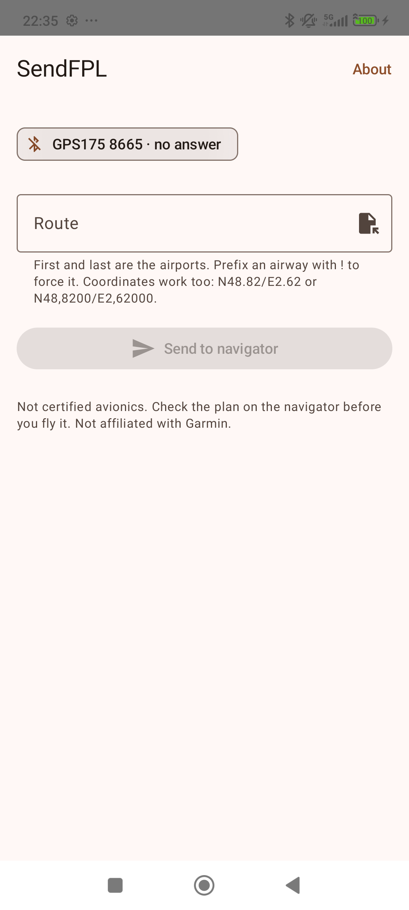

# SendFPL

[](https://github.com/0intro/sendfpl/actions/workflows/ci.yml)
[](LICENSE)

Send a flight plan from an Android phone to a Garmin navigator in the panel over Bluetooth.

**The purpose is interoperability.** A panel navigator accepts a flight plan over Bluetooth, and
the application you planned the flight in exports one, but no path connects the two unless both
ends are Garmin's. A route that already exists is therefore entered into the panel by hand, one
waypoint at a time.

SendFPL provides that path. Type a route, or open the file your planner exported, and it is sent
to the navigator in the aircraft.



**SendFPL is not certified avionics.** The navigator holds an imported plan for preview. Check
every waypoint there before you accept it. The pilot in command is responsible for the plan
flown. Not affiliated with Garmin.

There is a [home page](https://0intro.github.io/sendfpl/), and the
[privacy policy](https://0intro.github.io/sendfpl/privacy.html) is published beside it.

## Where a route comes from

Two planners were used to develop and test this:

* **[SD-VFR](https://skydreamsoft.fr/en_US/)**, by SkyDreamSoft, exports a navigation four ways:
  `.fpl`, `.gpx`, `.kml` and `.pln`. All four import as **the same route**. That is not automatic:
  the four files disagree about names, about how a position is written, and about how many points
  they contain.
* **[SkyDemon](https://www.skydemon.aero/)**, by Divelements, exports its own `.flightplan`, a
  GPX, a Garmin `.fpl` and a `.gfp`. Its Android application offers no share action for a route,
  so the route leaves through Route > Send by Email; share the attachment from your mail client.

Neither is required. Six formats are read, and what determines whether a file imports is the
format rather than the application that wrote it:

| Format | Written by, among others |
|---|---|
| Garmin `.fpl` | SD-VFR, SkyDemon, Garmin Pilot, [Little Navmap](https://albar965.github.io/littlenavmap.html) |
| GPX | SD-VFR, SkyDemon, and most software that records a route or a track |
| KML | SD-VFR, Google Earth |
| `.pln` | SD-VFR, Microsoft Flight Simulator and other simulators |
| `.flightplan` | SkyDemon, its native format |
| `.gfp` | SkyDemon, Garmin's GTN trainers, Little Navmap |

A file reaches the application three ways: open it from any file manager and choose SendFPL from
"Open with", share it from the application holding it, mail attachments included, or use the
folder icon in the route box. A route shared or pasted as plain text is also accepted, which
covers anything that offers a route as a line of text rather than as a file.

## What it does

* **Routes as text.** `LFPL CLM LFFZ LFQB`, identifiers separated by spaces. Coordinates work
  too, in several notations: `N48.84/E3.01`, `N48,8447/E3,01389`, `N4851/E00301`, or the wire
  form `N48507E003008`. Whether a token is an airway or a fix is a heuristic, since the
  navigation database is not ours to read, so either answer can be forced: `!V334` is an airway
  and `=E9` is a waypoint.
* **A route may begin and end anywhere.** An unlicensed strip has no ICAO code, and neither end
  is special on the wire, so a navigation from one field to another is a route like any other.
* **User waypoints.** A point can carry a name and its own position at once.
* **File import**, in the six formats above. Names too long for the navigator are shortened across
  the whole route while staying distinct from each other, and a file it cannot read fully is
  refused rather than imported short, since a route missing a point still looks like a route.
* **Limits that follow the device.** You pick the navigator model, and its identifier caps apply.
  A model whose limits are not known is refused rather than given someone else's numbers.
* **A device list that does not lie.** A paired navigator is never shown as connected before the
  app opens a socket to it, and a dimmed device is still selectable.
* **A protocol log.** Every packet, on screen, and in English whatever the phone is set to,
  because it is written to be pasted into a bug report.
* **English and French**, in the vocabulary ICAO and the SIA use: `point de cheminement` for a
  waypoint, `voie aérienne` for an airway. Text the navigator itself displays is quoted in its own
  English, so a menu path in the app is the menu path on the panel.

Requires Android 8.0 (API 26) or newer, and a navigator paired in Android's Bluetooth settings.
On the navigator, Flight Plan Import has to be enabled under Bluetooth Settings > Features.

## Building

The Gradle wrapper is in the tree, so you need a JDK 17 or newer and the Android SDK with API 37
installed: `platforms;android-37.0` and `build-tools;37.0.0` from `sdkmanager`. If the SDK is not
at `$ANDROID_HOME`, put `sdk.dir=/path/to/sdk` in `local.properties`, which is gitignored.

```sh
./gradlew :cxp:test :app:testDebugUnitTest   # 226 tests, no device needed
./gradlew :app:assembleDebug                 # lands in app/build/outputs/apk/debug/
adb install -r app/build/outputs/apk/debug/app-debug.apk
```

A release build is minified, which is not cosmetic: `material-icons-extended` carries about two
thousand icon builders for the seven this app draws, so R8 is the difference between a 12.7 MB
APK and a 1.4 MB one.

## Layout

* **`:cxp`** is the protocol and the route model, a plain Kotlin JVM library with no Android
  dependency.
* **`:app`** is everything Android: the RFCOMM link, the credential store, the Compose UI.

## The store listing

It is in the repository, at `app/src/main/play/`, so the words that describe the application are
reviewed as a diff like the application itself. Title, descriptions, release notes, contact
details, the icon, the feature graphic and the screenshots.

```sh
./gradlew :app:verifyPlayListing    # every Play limit, checked before anything authenticates
./gradlew :app:publishListing -Psendfpl.playCredentials=/path/to/play-service-account.json
```

`publishListing` pushes the listing and nothing else: it cannot create or promote a release, so
it is the safe one to run. `publishBundle` is the other half and needs the signing keystore and
the credential as well. The service account key is never defaulted to a path in the tree; without
one, the publish tasks are the only thing that fails, and they say why.

The same push runs from the Publish listing workflow, manually, from one repository secret. The
icon is generated from the application's own `ic_launcher_foreground.xml`, framed to the adaptive
icon's safe zone, so the icon on the store is the icon on the home screen.

## The credential

Connext authenticates with a single fixed application secret, and there is no mechanism by which an
independent client is issued one of its own. It is not in this repository.

That is the interoperability barrier this application exists to cross, stated plainly: the
protocol is undocumented and the only key to it ships inside somebody else's app. Recovering one
from a copy you already own, in order to make two things work together, is what the exception for
interoperability in EU and US copyright law is for. Redistributing it is a different act, so this
repository does not.

A build from this repository has no credential in it. The app asks you to supply one, and keeps
it encrypted under an Android Keystore key and out of backups. The build on Play carries one,
staged in from a file outside the tree, so its user is asked for nothing.

A release will not build without a credential. An app that authenticates to nothing looks healthy
until it reaches a navigator.

To build from a credential you recovered from your own copy of a Garmin app:

```sh
./gradlew :app:assembleRelease -Psendfpl.credential=/path/to/creds.json
```

## License

MIT. See [LICENSE](LICENSE).
